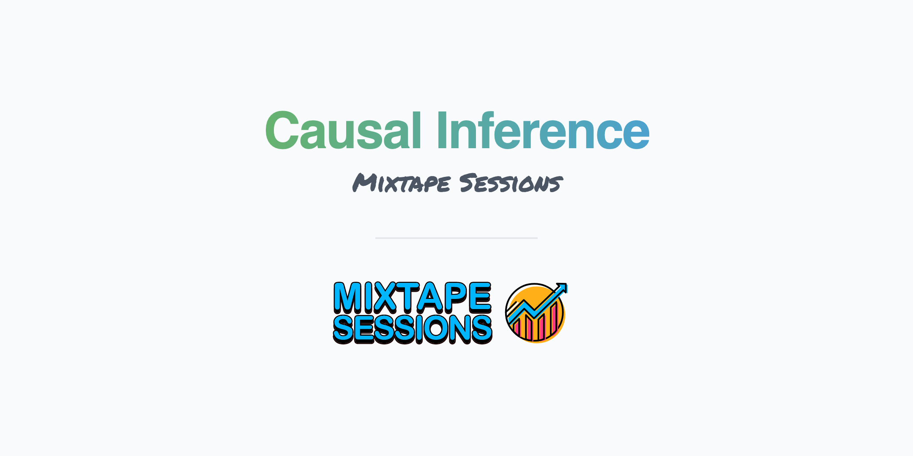

 
 

 

This workshop will cover foundational elements of modern practices of causal inference such as the potential outcomes model as well as discuss in detail the most common designs: regression discontinuity, instrumental variables, difference in differences, comparative case studies using synthetic control and if time permitting matching. It will be accompanied by efforts to introduce students to basic practices in programming as well as good research practices more generally. 
 

&nbsp;

&nbsp;

  
 
 

<b>Potential Outcomes</b>
 

<b>About</b>
The modern theory of causality is based on a seemingly simple idea called the "counterfactual".  The counterfactual is an unusual features of the arsenal of modern statistics because it is more or less storytelling about alternative worlds that may or may not exist, but could have existed had one single decision gone a different way.  Out of this idea grew what a model, complete with its own language, on top of which the field of causal inference is based, and the purpose of this lecture is to learn that language.  The language is called potential outcomes and it forms the basis for many causal objects we tend to be interested in, such as the average treatment effect.

<b>Slides</b>
...

<b>Code</b>
...

<b>Readings</b>

Mixtape chapter 4 <a href="https://mixtape.scunning.com/potential-outcomes.html">Potential Outcomes Causal Model</a>
...

 

<b>Selection Bias</b>
 

<b>About</b>
... 

<b>Slides</b>
...

<b>Code</b>
...

<b>Readings</b>
...

 

<b>Randomization Inference</b>
 

<b>About</b>
... 

<b>Slides</b>
...

<b>Code</b>
...

<b>Readings</b>
...

 

<b>Directed Acyclic Graphs</b>
 

<b>About</b>
... 

<b>Slides</b>
...

<b>Code</b>
...

<b>Readings</b>
...

 

<b>Sharp Regression Discontinuity</b>
 

<b>About</b>
... 

<b>Slides</b>
...

<b>Code</b>
...

<b>Readings</b>
...

 

<b>Instrumental Variables</b>
 

<b>About</b>
... 

<b>Slides</b>
...

<b>Code</b>
...

<b>Readings</b>
...

 

<b>Difference-in-Differences</b>
 

<b>About</b>
... 

<b>Slides</b>
...

<b>Code</b>
...

<b>Readings</b>
...

 

<b>Synthetic Control</b>
 

<b>About</b>
... 

<b>Slides</b>
...

<b>Code</b>
...

<b>Readings</b>
...

 

<b>Matching</b>
 

<b>About</b>
... 

<b>Slides</b>
...

<b>Code</b>
...

<b>Readings</b>
...

 

           

